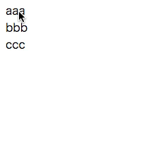
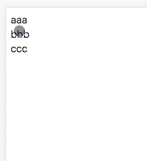
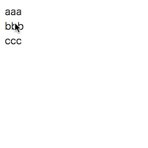

# react-dnd-example

This repository is simple sortable list code for practical use of react-dnd.

## Setup

```
npm install
npm start
```

## Dependencies

- react: ^15.6.2
- react-dnd: ^2.6.0
- react-dnd-html5-backend: ^2.6.0
- react-dnd-touch-backend: ^0.4.0
- react-dom: ^15.6.2
- react-scripts: 2.1.5

## hover code

Please move hover branch.

## Demo

### drag



### no_layer



### hover


